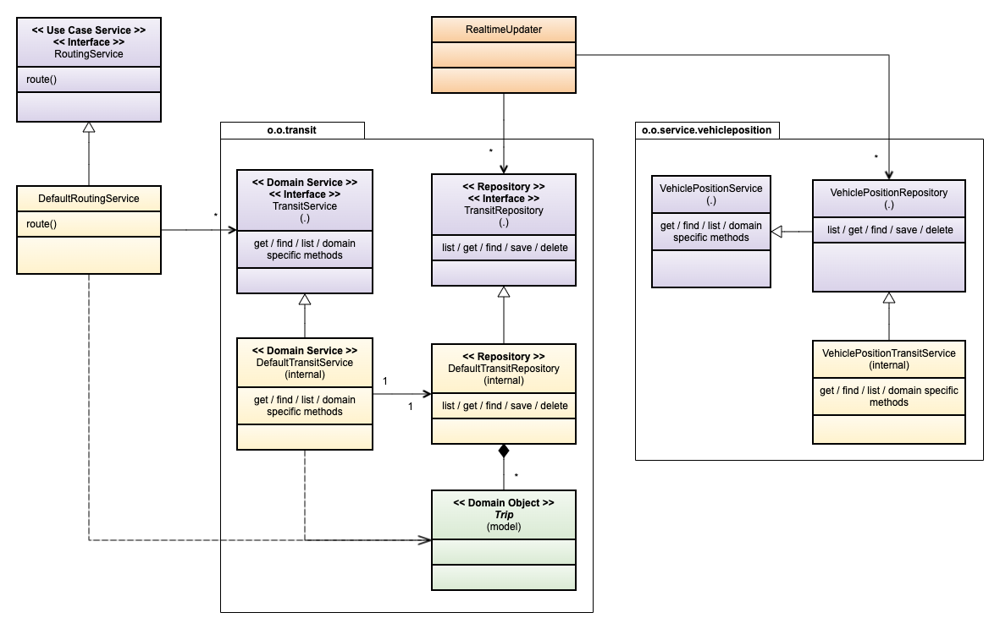

# Naming Conventions

In general, we use American English. We use the GTFS terminology inside OTP as the transit
domain-specific language. In cases where GTFS does not provide an alternative, we use NeTEx. The
naming should follow the Java standard naming conventions. For example, a "real-time updater" class
is named `RealTimeUpdater`. If in doubt, check the Oxford Dictionary (American).

## Packages

Try to arrange code by domain functionality, not technology. The main structure of a package should
be `org.opentripplanner.<domain>.<component>.<sub-component>`.

| Package                         | Description                                                                                                                                                                                                 |
| ------------------------------- |-------------------------------------------------------------------------------------------------------------------------------------------------------------------------------------------------------------|
| `o.o.<domain>`                  | At the top level, we should divide OTP into "domains" like `apis`, `framework`, `transit`, `street`, `astar`, `raptor`, `feeds`, `updaters`, and `application`.                                             |
| `component` and `sub-component` | A group of packages/classes that naturally belong together; think aggregate as in Domain-Driven Design.                                                                                                     |
| `component.api`                 | Used for components to define the programing interface for the component. If present, (see Raptor) all outside dependencies to the component should be through the `api`.                                   |
| `component.model`               | Used to create a model of Entities, ValueObjects, etc. If exposed outside the component, you should include an entry point like `xyz.model.XyzModel` and/or a Service (in `api` or component root package). |
| `component.service`             | Implementation of a service like `DefaultTransitService`; may also contain use case-specific code. Note: The Service interface goes into the component root or `api`, not in the service package.           |
| `component.configure`           | Component creation/orchestration. Put dependency injection code here, like the Dagger module.                                                                                                               |
| `support`                       | Sometimes domain logic gets complicated; then extracting/isolating it helps. `support` is used internally in a component, not outside.                                                                      |
| `framework`                     | (Abstract) building blocks internal to a domain/parent package. In some cases accessed outside the component; e.g., `OptAppException`, `TransitEntity`.                                                     |
| `mapping`                       | Map between two domains/components.                                                                                                                                                                         |
| `util`                          | General "util" functionality, often characterized by `static` methods. Dependencies to other OTP packages are NOT allowed; only third-party utils libraries.                                                |
| `o.o.apis`                      | OTP external endpoints. Note! Many APIs are in the Sandbox where they are in the `o.o.ext` package.                                                                                                         |

> **Note!** The above is the goal. The current package structure needs cleanup.

> **Note!** Util methods depending on an OTP type/component should go into that type/component, not
> in the utils class; e.g., static factory methods. Warning: The "pure" utilities right now are
> placed into subpackages of `o.o.util`. The root package needs cleanup.

## Methods

Here is a list of common prefixes used and what to expect.

| Good method prefixes                                  | Description                                                                   |
|-------------------------------------------------------|-------------------------------------------------------------------------------|
| `stop() : Stop`                                       | Field accessor, equivalent to `getStop` as in the Java Bean standard.         |
| `getStop(ID id) : Stop`                               | Get Stop by ID; throws exception if not found.                                |
| `getStops(Collection<ID> id) : List/Collection<Stop>` | Get _all_ Stops by set of IDs; throws exception if not found.                 |
| `findStop(Criteria criteria) : Optional<Stop>`        | Find one or zero stops; return `Optional`.                                    |
| `findStops(Criteria criteria) : List/Stream<Stop>`    | Find 0, 1, or many stops; return a Collection or Stream (List is preferred).  |
| `listStops() : List/Stream<Stop>`                     | List ALL stops in context; return a Collection or Stream (List is preferred). |
| `initStop(Stop stop) : void`                          | Set property _once_; a second call throws an exception.                       |
| `createStop(String name, ...) : Stop`                 | Factory methods for creating objects should start with `create` prefix.       |
|                                                       | See (Builder Conventions)[RecordsPOJOsBuilders.md#builder-conventions] for creating objects with builders. |
| `addStop(Stop stop) : void/Builder`                   | Add a Stop to a collection of Stops.                                          |
| `addStops(Collection<Stop> stops) : void/Builder`     | Add set of Stops to existing set.                                             |
| `withBike(Consumer<BikePref.Builder> body) : Builder` | For nested builders, use lambdas.                                             |
| `withStop(Stop stop) : Builder`                       | Set Stop in builder, replacing existing value; return `this` builder.         |
| `of(FeedScopedId id) : Builder`                       | Create new builder instance from  `Stop` class.                               |
| `copyOf() : Builder`                                  | Initialize a new builder instance from `Stop` instance with identical values. |
| `build() : Stop`                                      | Finish building stop with a builder.                                          |

These prefixes are also "allowed" but not preferred; they have some kind of negative "force" to
them.

| Okay method prefixes, but ...               | Description                                                                                            |
|---------------------------------------------|--------------------------------------------------------------------------------------------------------|
| `withStops(Collection<Stop> stops) : this`) | Replace all Stops in builder with new set. Consider using `addStops(...)` instead.                     |
| `setStop(Stop stop)`                        | Set a mutable Stop reference. Avoid if not part of natural lifecycle. Use `initStop(...)` if possible. |
| `getStop() : Stop`                          | Old style accessor. Use the shorter form `stop() : Stop`.                                              |


## Variables

We follow the Java standard of using camelCase with a lower-case first letter for variable names. However, variables of numeric types may include units as an underscore-separated suffix. For example, `length_mm` or `duration_msec`. The reason is that case is significant in metric prefixes (e.g. `M` for mega- versus `m` for milli-). The underscore also reinforces that these are units rather than part of the base variable name.


## Service, Model and Repository



Naming convention for builders with and without a context.

#### Graph Builds and Tests Run Without a Context

```java
// Create a new Stop
trip = Trip.of(id).withName("The Express").build();

// Modify and existing stop
stop = stop.copyOf().withPrivateCode("TEX").build();
```

## Referencing Established OTP Terminology in Documentation

Use emphasis ("_dated service journey_") in markdown documentation, in API, and configuration
documentation. In this kind of documentation we usually talk about the concept, not the implementing
class. Use CamleCase (eg. TripOnServiceDate) if you need to reference the class.

Use hyphen ("dated-service-journey") in plain text and JavaDoc. In JavaDoc we also use
{@link TripOnServiceDate} the first time we mention a class. Note that sometimes we want to talk
about the concept (dated-service-journey) and sometimes we reference a class 
({@link DatedServiceJourney}).